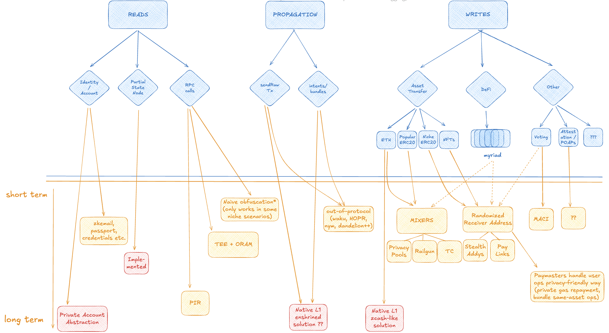

# Diagram

We split the onchain privacy problem space into three basic categories:

- **Reads** (reading data from the chain)
- **Writes** (data that actually gets written onchain)
- **Propagation** (sending data to be written onchain)

*key: blue=problems, orange=solutions, red=L1 delivered solutions*

to see diagram higher res and interactive, [click here](https://excalidraw.com/#json=aoLPXZTaoZxiKPuFXO9gx,1CWOb7N2pFueCwwkRNZcJQ)